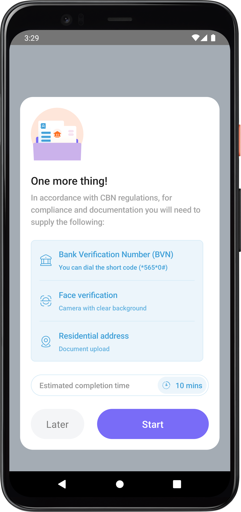
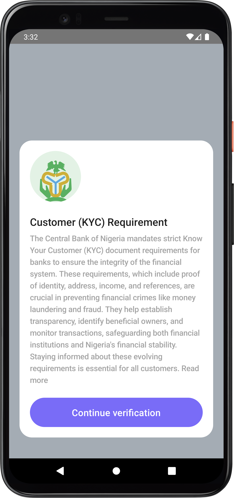
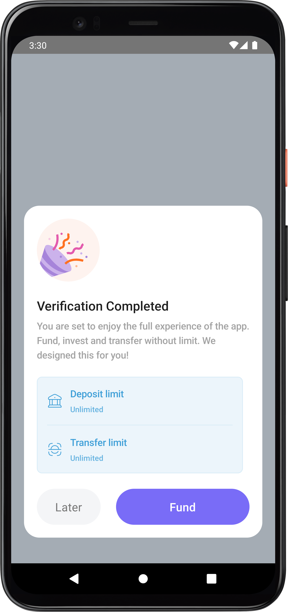

# Compose KYC

Compose KYC is an android that implements a Bank Verification Number(CBN) Consent Flow designed by
Leye Ogunsanya.The app was built with [Jetpack Compose](https://developer.android.com/jetpack/compose)

## Screenshots

## Features

This sample contains 4 screens: initial screen, 1 BVN consent screen and 2 confirmation screens

### App scaffolding

Package [`com.ajibsbaba.composekyc`]

[`MainActivity`] is the application's entry point. Each screen is implemented inside
a `Composable dunction` and [`MainActivity`] is the host `Activity` for all of
the `Composable functions`s.
The navigation between them uses the Navigation Compose Library. The screens and the navigation are
defined in [`Navigation.kt`]

### Data

The data in the sample is static